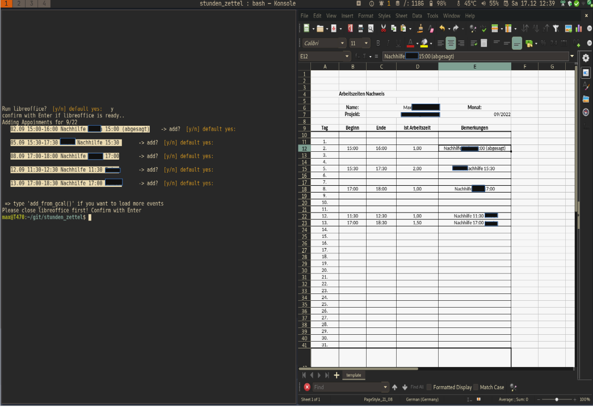

# Stundenzettel Generator für die easy Stundenerfassung
 Ein kleines Programm das die Termine aus dem GoogleCal importiert und daraus eine Abrechnung erstellt.
 Das Programm öffnet ein libreoffice calc sheet und füllt es je nach Wahl im Terminal aus.
 
 Speichern des Blattes und benennen muss selbst passieren, ggf Anpassungen an dem Sheet sind so möglich.

- der genutzte Google Calendar ist in `./credentials/google_mail_accounts.meine_config` definiert
- im Code in ```main.py``` werden die Termine nach einem Suchbegriff gefiltert, in der Version hier ist default  **"Nachhilfe"** 





## Setup

- you will need to setup the google mail, the quickstart only takes a few minutes:  https://developers.google.com/gmail/api/quickstart/python

## How to Use..


```
usage: BillingTimesheetGenerator [-h] [-f] [-q SearchKeyword] [-m month]

A simple script to import and write googlecalendar events to an libreoffice-calc sheet.

optional arguments:
  -h, --help            show this help message and exit
  -f, --fast            Execute in fast mode. The events will be imported straight, there will be no confirmation necessary through cmdline
  -q SearchKeyword, --query SearchKeyword
                        Events will be filtered by this string. (CaseINsensitiv -> Office = office)
  -m month, --month month
                        The month (1-12) for which the billing timesheet should be generated. Default is last month.

The program will open libreoffice, and fill out the sheet, at any time you can edit the
sheet by yourself and quit the program with ctrl-d. (You might leave a loop with ctrl-c
before) As   this script is intended to be used side by side with libreoffice open, so
you can control the import of appoinments there is one important note just  as any
LibreOffice sheet...:

 YOU NEED TO SAVE THE SHEET BY YOURSELF!

TODO If you use the -straigt-mode this is of course not the case.

author: Max Nicolay
date:   11/08/2022

```


- run via console as './main.py' or python3 main.py 
- bestätige öffnen von libre office mit Enter
- bestätige dass es geöffnet wurde (ist etwas unsauber programmiert.. python muss warten bis libreoffice wirklich offen ist bevor es weitergeht..)
- weiter mit Enter, Fragen ggf `n` oder `no` beantworten (yes) ist immer default
 

## CANdo

- add autocomplete.. -> https://stackoverflow.com/questions/14597466/custom-tab-completion-in-python-argparse 


### Falls je weiter entwickeln:
- Gute Dokumentation zur LibreOffice Uno-Api
- https://www.openoffice.org/de/doc/entwicklung/python_bruecke.html#intro
- noch viel mehr möglich..
    - u.a einbinden in die GUI von Libre Office
    - speichern als etc..
    - exportieren als..
    - uvm 

## benutzte Quellen 
- https://medium.com/analytics-vidhya/macro-programming-in-openoffice-libreoffice-with-using-python-en-a37465e9bfa5

- https://github.com/rebahozkoc/libreofficepythonmacros
